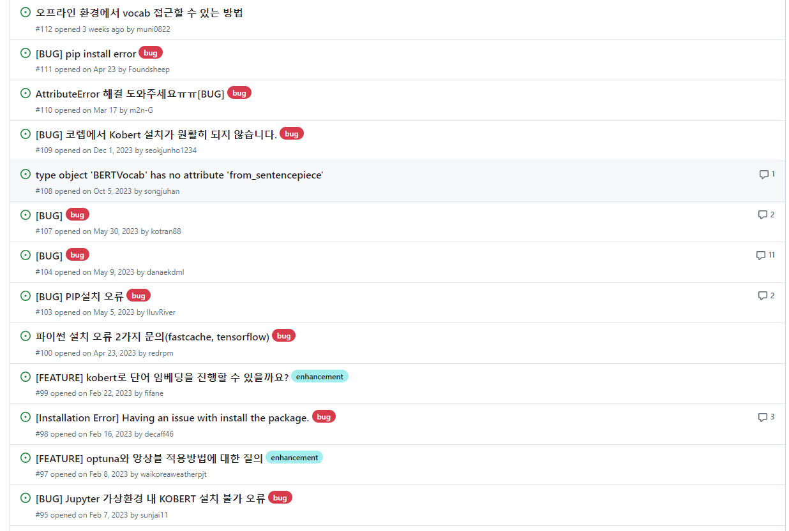

# [Week15] 나만의 무기를 갖기 - 2

프로젝트를 개발하며 Keyword를 추출하는 것이 아무래도 Main Server에서 수행하면 부하가 너무 심할 것 같아서 차라리 언어에 친화적인 NLP Server를 따로 구성하기로 했다. 그리고 사용할 수 있을 만한 기술들을 찾아봤는 데, KRWordRank, Elmo, KoBERT 등의 라이브러리와 언어모델을 사용할 수 있을 것 같다.

KRWordRank는 비지도학습으로 키워드를 추출해주는 라이브러리다. 그래서 이를 이용하여 문장에서 단어를 추출하는 데 성공했고, 조사나 부사까지는 필터링이 가능하다는 것을 깨달았다. 그러나 다른 문제가 생겼다. KRWordRank는 이 문맥에서의 가장 중요한 단어를 추출한다기 보다는 반복적으로 많이 나오는 단어에 대해서 중요도가 올라가서 가장 중요한 단어 순서로 뽑아줄 수 없었다. 또한, stopwords로 추출되지 않아야하는 단어를 지정해주는 방식이었다.

이 때문에 키워드간의 관계가 아닌 단순한 **문장 속의 단어간의 연결** 로 끝나버려서 키워드맵이라고 할 수 없었다. 또한 예를 들어 누군가 '아니'라는 단어로 시작하는 말버릇이 있다면,

> '아니, 그게 아니고 나는 밥보단 치킨이 좋다는 거지'

> '아니, 이게 무슨일이야'

> '아니, 자바가 더 좋을 것 같은데? 왜 자바 스크립트로 해야하는 지 진짜 모름'

이런식 구성된 문장으로 단어를 추출하게 되면 들어오는 키워드는

```py
{
    '아니': 4,
    '자바': 2,
    '밥': 1,
    '치킨': 1,
    '무슨일': 1,
    '스크립트': 1,
    '진짜': 1,
    '모름': 1,
}
```

이런 식으로 추출이 돼버려서 아니가 가장 중요한 단어로 추출해버린다. 그래서 비지도학습으로 추출하는 것에는 한계가 있다고 생각되어 포기하게 되었다.

그래서 KoBERT라는 SKT에서 오픈소스로 제공해주는 것을 사용하고 자 했다. 그러나 KoBERT가 제대로 설치되지 않았고, 이를 해결하기 위해 서칭을 하기 시작했다. 이슈 페이지를 들어가보니, 2023년부터 이러한 이슈들이 계속 올라오고 있었는 데, 이미 지원을 멈춘 것인 지 이슈에 대한 응답은 없었다.



그래서 직접 이슈 페이지를 들어가 확인해보니 파이썬 버전이 업데이트되면서 사용할 수 없게 됐었다. 그러나 우리는 이미 Python 3.11 이상에서만 돌아가는 라이브러리들을 사용중이었고, 그에 따라 KoBert 사용하는 것을 포기하고 Llama를 사용해 시도하려 했다. 그러나 AWS에서 제공하는 Free Server로 Llama를 구동하는데는 한계가 있었고, 우리는 결국 ChatGPT API로 키워드들을 추출하도록 하는 수 밖에 없었다.
