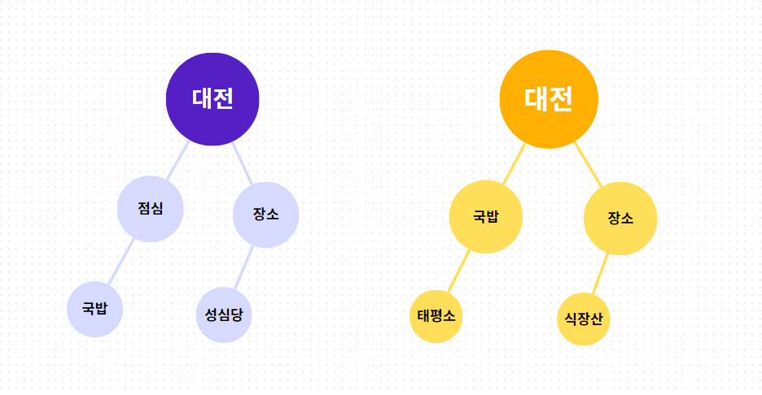
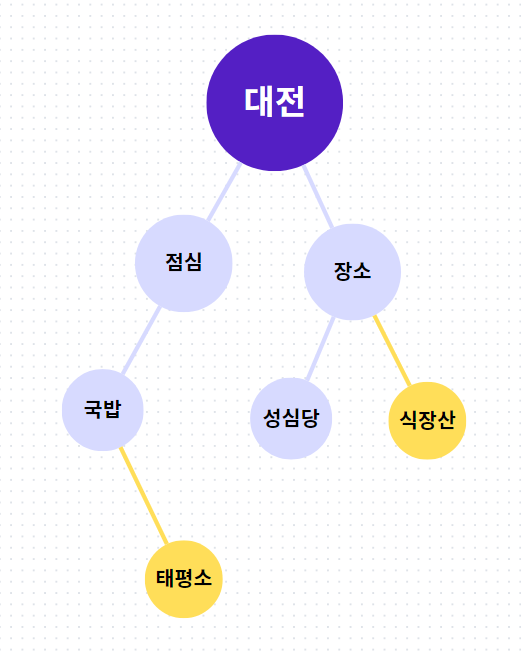
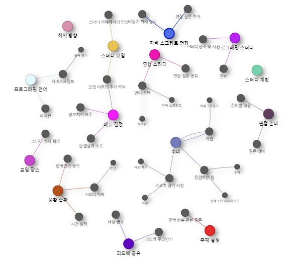

# [Week15] 나만의 무기를 갖기 - 4

중간 발표를 마쳤는 데, 운영진 측에서 키워드 맵으로 문맥 파악이 전혀 안되는 데 문맥 파악이 되었다고 억지를 부리는 느낌이다. 수정하라는 피드백이 들어왔다. 이 때문에 다시 회의를 했는 데, 결국 문맥 파악이라는 것에 초첨을 두게 되면 키워드 맵으로는 당연히 단어끼리의 연결이기 때문에 될 수가 없었고, 다시 처음으로 돌아가 마인드 맵으로 수정해야 한다는 결론이 나왔다. 차라리 처음에 마인드맵으로 하지말고 키워드맵으로 하라는 피드백이 없었으면 더 나았을까? 라는 생각도 문득 스쳐지나갔다.

그러나 우리의 아키텍쳐는 이미 키워드 맵에 맞게 끔 수평 관계로 구성되어 있었다. 각 노드는 서로의 존재를 모르고 이 노드들을 연결하는 Edge라는 구조체가 있는 상태였다. 이를 마인드맵으로 수정하려면 일단 상하 관계가 돼야 한다고 생각했다. 마인드맵이라는 것은 결국 상위 카테고리에서 하위 카테고리를 갖고 있는 그런 형태라고 생각한다. 이를 위해서 각자의 노드는 자신의 하위 노드를 알고 있어야 했다. 그러나 이미 시간은 1주 밖에 안 남았고 아키텍쳐를 수정하는 것은 불가능하다고 판단했다.

이를 고민하다가 `Schema`는 그대로 둔 상태에서 parsing하는 `DTO`와 ChatGPT에 요청하는 프롬프트를 수정하여 마인드맵을 그리도록 수 테스트를 진행했다.

기존의 코드는

```js
class SummaryBody {
  @ApiProperty({ description: "Keyword of the main item" })
  @IsString()
  @IsNotEmpty()
  keyword: string;

  @ApiProperty({ description: "Title of the main item" })
  @IsString()
  @IsNotEmpty()
  subject: string;
}

export class SummarizeResponseDto {
  @ApiProperty({ description: "Main item", type: SummaryBody })
  @ValidateNested()
  @Type(() => SummaryBody)
  main: SummaryBody;

  @ApiProperty({ description: "Sub-items", type: [SummaryBody] })
  @IsArray()
  @ValidateNested({ each: true })
  @Type(() => SummaryBody)
  sub: SummaryBody[];
}
```

이런식의 단순히 하나의 아이디어에서 여러개의 아이디어를 갖고 있는 방식이었다.

```js
export class SummaryBody {
  @ApiProperty({ description: 'Keyword of the item' })
  @IsString()
  @IsNotEmpty()
  keyword: string;

  @ApiProperty({ description: 'Title of the item' })
  @IsString()
  @IsNotEmpty()
  subject: string;

  @ApiProperty({ description: 'Sub items', type: [SummaryBody], required: false })
  @IsArray()
  @ValidateNested({ each: true })
  @Type(() => SummaryBody)
  @IsOptional()
  sub?: SummaryBody[];
}

export class SummarizeResponseDto {
  @ApiProperty({ description: 'Idea array', type: [SummaryBody] })
  @IsArray()
  @ValidateNested({ each: true })
  @Type(() => SummaryBody)
  idea: SummaryBody[];
}
```

이를 상위와 하위로 구분 짓고 파이썬의 프롬프트도 수정하여 어떻게든 마인드맵의 구성처럼 수정했다.

그리고 마인드맵으로 수정하며 또 다른 문제가 발생했는 데, 겹치는 키워드에 대해서 어떻게 처리할 것인가에 대한 것이었다. 이를 처음에는 키워드가 겹치기만 하면 기존의 키워드 하위에 노드가 생기도록 코드를 짰는 데, 오늘 점심 메뉴, 내일 점심 메뉴, 여행가서 먹을 점심 메뉴가 합쳐지는 문제가 생겼고 이를 해결하기 위해 메인 아이디어가 같은 뿌리를 갖고 있을 때만 노드를 뿌리도록 수정했다.

이를 통해



이렇게 생긴 2개의 트리가



한개의 트리로 합쳐질 수 있도록 했다.

## 완성본


